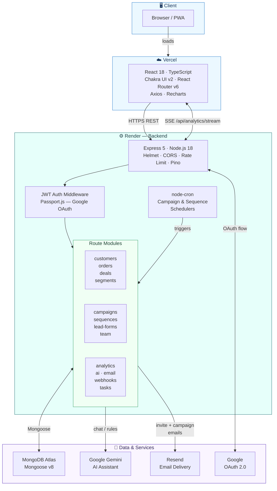

# Flayx CRM — Backend API

Node.js + Express 5 REST API for Flayx CRM. Handles authentication, customer/order/deal management, email campaigns, drip sequences, lead capture forms, team invites, real-time analytics, and a Gemini AI assistant.

**Live API:** https://smartserve-crm-backend.onrender.com  
**Health check:** https://smartserve-crm-backend.onrender.com/health  
**API docs (auth required):** https://smartserve-crm-backend.onrender.com/api-docs

---

## Recent Features (v2)

| # | Feature | What it does |
|---|---------|-------------|
| 1 | **Empty states** | Blank list pages show a contextual prompt with a CTA button instead of nothing |
| 2 | **Toast notifications** | Success/error feedback toast after every CRUD action across all pages |
| 3 | **Email open & click tracking** | Resend webhooks update `deliveryStats.opened` / `deliveryStats.clicked` on campaigns in real time |
| 4 | **Task reminders** | Hourly scheduler emails + push-notifies the task owner when a task is due within 24 hours |
| 5 | **Onboarding wizard** | 3-step modal on first login walks new users through adding a customer, creating a deal, and launching a campaign |
| 6 | **PWA + push notifications** | Service worker for offline/installable app; VAPID push notifications for task reminders |

---

## Tech Stack

| Layer | Technology |
|-------|-----------|
| Runtime | Node.js 18+ |
| Framework | Express 5 |
| Database | MongoDB Atlas + Mongoose v8 |
| Auth | JWT + Passport.js (Google OAuth 2.0) |
| Email | Resend (transactional), nodemailer fallback |
| AI | Google Gemini API |
| Logging | Pino (structured JSON logs) |
| Security | Helmet, express-rate-limit, custom NoSQL sanitizer |
| Push Notifications | web-push (VAPID / Web Push API) |
| Scheduler | node setInterval (campaign, sequence, task reminder delivery) |

---

## Project Structure

Feature-module layout: each domain owns its controller, routes, and feature-specific services in one place.

```
SmartServe-CRM-Backend/
├── modules/                       # Feature modules — co-located controller + routes + services
│   ├── ai/
│   │   ├── ai.controller.js
│   │   ├── ai.routes.js
│   │   └── ai.service.js
│   ├── analytics/
│   │   ├── analytics.controller.js
│   │   ├── analytics.routes.js
│   │   └── analytics-sse.service.js
│   ├── auth/
│   │   ├── auth.controller.js     # Login, register, demo, Google OAuth, generateToken
│   │   └── auth.routes.js
│   ├── campaigns/
│   │   ├── campaign.controller.js
│   │   ├── campaign.routes.js
│   │   ├── campaign-scheduler.service.js
│   │   └── campaign-queue.service.js
│   ├── customers/
│   │   ├── customer.controller.js
│   │   └── customer.routes.js
│   ├── email/
│   │   ├── email.controller.js
│   │   ├── email.routes.js
│   │   └── email.service.js       # Resend — invite + campaign emails
│   ├── lead-forms/
│   │   ├── lead-form.controller.js
│   │   └── lead-form.routes.js
│   ├── orders/
│   │   ├── order.controller.js
│   │   └── order.routes.js
│   ├── pipeline/
│   │   ├── deal.controller.js
│   │   ├── deal.routes.js
│   │   ├── custom-field.controller.js
│   │   └── custom-field.routes.js
│   ├── segments/
│   │   ├── segment.controller.js
│   │   └── segment.routes.js
│   ├── sequences/
│   │   ├── sequence.controller.js
│   │   ├── sequence.routes.js
│   │   └── sequence-scheduler.service.js
│   ├── tasks/
│   │   ├── task.controller.js
│   │   ├── task.routes.js
│   │   ├── tasks-global.routes.js
│   │   └── task-reminder.service.js   # hourly scheduler — sends reminder email + push 24h before due date
│   ├── push/
│   │   ├── push.controller.js         # getVapidKey, subscribe, unsubscribe, sendPushToUser
│   │   └── push.routes.js
│   ├── team/
│   │   ├── team.controller.js     # Invite, accept, RBAC
│   │   └── team.routes.js
│   └── webhooks/
│       ├── webhook.controller.js
│       └── webhook.routes.js
├── models/                        # Shared Mongoose models (12 total)
│   ├── user.model.js              # organizationOwner, teamRole fields
│   ├── customer.model.js
│   ├── order.model.js
│   ├── campaign.model.js
│   ├── segment.model.js
│   ├── deal.model.js
│   ├── sequence.model.js
│   ├── lead-form.model.js
│   ├── custom-field.model.js
│   ├── team-invite.model.js       # token, expiresAt, accepted
│   ├── task.model.js                  # includes reminderSentAt — set when 24h reminder fires
│   ├── push-subscription.model.js     # stores browser PushSubscription objects per user
│   └── communication-log.model.js     # openedAt + clickedAt tracked via Resend webhooks
├── services/                      # Shared/utility services (cross-domain)
│   ├── vendor.service.js          # Delivery orchestration — sends emails, updates stats
│   ├── query-builder.service.js
│   └── seed.service.js
├── config/
│   └── passport.js                # Google OAuth strategy
├── middleware/
│   ├── auth.middleware.js          # JWT decode; req.user.id = orgId || id
│   ├── error.middleware.js
│   └── validation.middleware.js
├── utils/
│   ├── logger.js                  # Pino instance
│   └── validateEnv.js             # Fails fast if required env vars are missing
├── swagger.json
├── index.js                       # App entry point, all route registrations
└── package.json
```

---

## Architecture



---

## Local Setup

### Prerequisites

- Node.js 18+
- MongoDB Atlas connection string (or local MongoDB)
- Google Cloud project with OAuth 2.0 credentials
- Resend API key (for email delivery)
- Google Gemini API key

### 1. Clone and install

```bash
git clone <repo-url>
cd SmartServe-CRM-Backend
npm install
```

### 2. Create `.env`

```env
MONGODB_URI=mongodb+srv://<user>:<password>@cluster0.xxxxx.mongodb.net/flayx
JWT_SECRET=your-long-random-secret
PORT=5000
NODE_ENV=development

# Google OAuth
GOOGLE_CLIENT_ID=your-google-client-id
GOOGLE_CLIENT_SECRET=your-google-client-secret
GOOGLE_CALLBACK_URL=http://localhost:5000/api/auth/google/callback

# Frontend origin (CORS + invite links)
CLIENT_URL=http://localhost:3000

# Email (Resend)
RESEND_API_KEY=re_...
RESEND_WEBHOOK_SECRET=whsec_...   # optional — set in Resend dashboard to enable signature verification

# Push Notifications (VAPID)
# Generate once: node -e "const wp=require('web-push'); console.log(wp.generateVAPIDKeys())"
VAPID_PUBLIC_KEY=<base64url public key>
VAPID_PRIVATE_KEY=<base64url private key>
VAPID_EMAIL=mailto:admin@yourdomain.com

# AI
GEMINI_API_KEY=your-gemini-api-key
```

> All `.env` files are in `.gitignore`. Never commit credentials.

### 3. Run

```bash
# Development (nodemon)
npm run dev

# Production
node index.js
```

Server starts at `http://localhost:5000`.

---

## API Reference

All endpoints except `/health`, `/api/auth/*`, and `POST /api/team/accept` require a `Bearer <JWT>` token in the `Authorization` header.

### Auth

```
POST   /api/auth/register
POST   /api/auth/login
POST   /api/auth/demo              Returns JWT for demo@flayx.app (no credentials needed)
GET    /api/auth/google
GET    /api/auth/google/callback
GET    /api/auth/me
```

### Customers

```
GET    /api/customers
POST   /api/customers
GET    /api/customers/:id
PUT    /api/customers/:id
DELETE /api/customers/:id
```

### Orders

```
GET    /api/orders
POST   /api/orders
GET    /api/orders/:id
GET    /api/orders/customer/:customerId
PATCH  /api/orders/:id/status
```

### Campaigns

```
GET    /api/campaigns
POST   /api/campaigns
GET    /api/campaigns/:id
GET    /api/campaigns/:id/stats
POST   /api/campaigns/:id/activate
POST   /api/campaigns/preview
```

### Segments

```
GET    /api/segments
POST   /api/segments
GET    /api/segments/:id
PUT    /api/segments/:id
DELETE /api/segments/:id
```

### Deals (Pipeline)

```
GET    /api/deals
POST   /api/deals
GET    /api/deals/:id
PUT    /api/deals/:id
DELETE /api/deals/:id
PATCH  /api/deals/:id/stage
```

### Sequences (Drip Email)

```
GET    /api/sequences
POST   /api/sequences
GET    /api/sequences/:id
PUT    /api/sequences/:id
DELETE /api/sequences/:id
POST   /api/sequences/:id/activate
```

### Lead Forms

```
GET    /api/lead-forms
POST   /api/lead-forms
GET    /api/lead-forms/:id
PUT    /api/lead-forms/:id
DELETE /api/lead-forms/:id
POST   /api/lead-forms/:token/submit    No auth — public submission endpoint
```

### Custom Fields

```
GET    /api/custom-fields
POST   /api/custom-fields
DELETE /api/custom-fields/:id
```

### Tasks

```
GET    /api/tasks                               All tasks for the org
GET    /api/customers/:customerId/tasks
POST   /api/customers/:customerId/tasks
PATCH  /api/customers/:customerId/tasks/:id
DELETE /api/customers/:customerId/tasks/:id
```

### Team

```
GET    /api/team                        List all team members
GET    /api/team/invites                List pending invites
POST   /api/team/invite                 Send an invite email
DELETE /api/team/invites/:inviteId      Revoke an invite
POST   /api/team/accept                 Accept invite, create/link user account (no auth)
GET    /api/team/invite-info/:token     Get invite details before signup (no auth)
PATCH  /api/team/members/:id/role       Change member role (admin/member)
DELETE /api/team/members/:id            Remove a member
```

### Analytics

```
GET    /api/analytics/summary
GET    /api/analytics/stream            SSE — real-time dashboard updates
```

### AI

```
POST   /api/ai/chat
POST   /api/ai/convert-rules
POST   /api/ai/generate-message
```

### Email

```
GET    /api/email/logs
POST   /api/email/test
```

### Webhooks

```
POST   /api/webhooks/resend    Called by Resend on email.opened / email.clicked / email.bounced
```

Signature verified via HMAC-SHA256 (Svix headers). Increments `campaign.deliveryStats.opened`
and `campaign.deliveryStats.clicked` in real time.

### Push Notifications (PWA)

```
GET    /api/push/vapid-key           Public — returns VAPID public key for browser subscription
POST   /api/push/subscribe           Store a PushSubscription object (auth required)
POST   /api/push/unsubscribe         Remove a subscription (auth required)
```

The task reminder scheduler calls `sendPushToUser()` internally to deliver push notifications
alongside the reminder email. Expired subscriptions (HTTP 410/404 from push service) are
automatically pruned.

### System

```
GET    /health          No auth — returns DB status and uptime
GET    /api-docs        Swagger UI (auth required)
```

---

## Authentication & Multi-Tenancy

JWT payload:

```json
{
  "id": "<orgId or userId>",
  "email": "user@example.com",
  "role": "user",
  "teamRole": "owner | admin | member",
  "orgId": "<organization owner's userId>"
}
```

`auth.middleware.js` resolves `req.user.id = decoded.orgId || decoded.id`, so all data queries are automatically scoped to the org owner. Team members transparently access the same data as their owner.

`req.user.ownId = decoded.id` gives the actual logged-in user's ID (used for audit trails and invite-sender lookups).

---

## Deployment (Render)

- Build command: `npm install`
- Start command: `node index.js`
- Environment variables set in Render dashboard (not in git)
- `app.set('trust proxy', 1)` is required — Render sits behind a reverse proxy and express-rate-limit will throw `ERR_ERL_UNEXPECTED_X_FORWARDED_FOR` without it

### Google OAuth production config

Set in Google Cloud Console:

- Authorized redirect URI: `https://smartserve-crm-backend.onrender.com/api/auth/google/callback`
- Authorized JS origin: `https://smart-serve-crm-frontend.vercel.app`

---

## Known Gotchas

**Mongoose v8 — `connection.close()` is Promise-only**

```js
// Broken (v7 signature, removed in v8):
mongoose.connection.close(false, callback)

// Correct:
mongoose.connection.close().then(...).catch(...)
```

**`findOneAndUpdate` skips `pre('save')` hooks**  
Any token/default generation must happen in the controller, not in a Mongoose save hook, when using upserts. See `controllers/team.controller.js` for the invite token pattern.

**`CLIENT_URL` must match the frontend origin exactly**  
CORS rejects any origin not in `allowedOrigins`. A missing or wrong `CLIENT_URL` returns a 500
with no CORS headers — the browser sees a network failure, not a 403. Always set `CLIENT_URL`
to the exact Vercel URL (`https://flayx-crm.vercel.app`) with no trailing slash.
The production Vercel URL is also hardcoded as a fallback in `index.js`.

**Render silent fallback on SyntaxError**  
If `index.js` has a syntax error (e.g. from committed git conflict markers), Render keeps the previous container running rather than crashing. Symptom: health check 200 but new routes return 404.

---

## Rate Limits

| Scope | Window | Max requests |
|-------|--------|-------------|
| All `/api/*` | 15 min | 200 |
| `/api/auth/*` | 15 min | 20 |
| `/api/ai/*` | 15 min | 30 |
| `/api/email/test` | 1 hour | 10 |

---

## License

MIT
